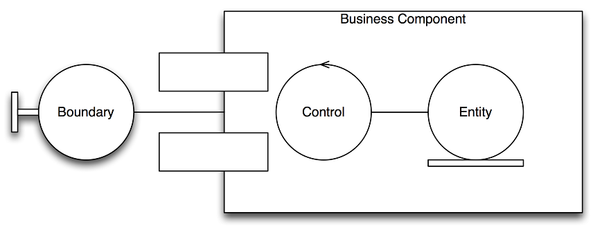

= Java EE applications - ćwiczenia

Ten projekt zawiera przykłady (ćwiczenia oraz rozwiązania ćwiczeń do szkolenia z podstawy Java EE). Zestaw ćwiczeń odnosi się do JavaEE6

== Ćwiczenia

Celem zadań będzie napisanie aplikacji agregującej wpisy z różnych stron newsowych (udostępniających wpisy poprzez RSS). Aplikacja będzie budowana stopniowo podczas szkolenia, wraz z kolejnymi aspektami platformy JEE6 przedstawianymi podczas szkolenia.

Agregacja artykułów będzie wykorzystywać ideę pubsubhubbub (PuSH), czyli protokół umożliwiający bardzo szybkie dostarczenie wiadomości do czytnika RSS.

> A simple, open, server-to-server web-hook-based pubsub (publish/subscribe) protocol as an extension to Atom and RSS.
>
> Parties (servers) speaking the PubSubHubbub protocol can get near-instant notifications (via webhook callbacks) when a topic (feed URL) they're interested in is updated.

Nasza aplikację będzie miała za zadanie agregować tak dostarczane wpisy: odbierać je, przetwarzać, zapisywać w bazie danych, udostępniać podstawowe statystyki poprzez kilka różnych formatów (lub nawet sposobów) – przez wszystkie te etapy przejdziemy podczas szkolenia.

Bazowy projekt, przykłady oraz materiały szkoleniowe są do pobrania z: http://github.com/kubamarchwicki/training-jee

== Zadanie 1: Komponenty sesyjne

Na początek stworzymy kilka komponentów zajmujących się przetwarzaniem (a dokładnie parsowaniem) samej wiadomości.
Zacznijmy od grama teorii, w ogólności niemal każdą funkcjonalność implementuje „wzorzec” Entity, Control, Boundary i można ją przedstawić na prostym schemacie blokowych:

Odpowiedzialność każdego elementu jest dość ściśle określona:

Boundary:: fasada, element będący wejściem do systemu dla interfejsu użytkownika (bądź jakiejkolwiek innej interakcji z użytkownikiem)
Control:: to jest serwis (lub zestaw serwisów) oddzielonych od zewnętrznego świata; mogą być to skąp likowane serwisy bądź proste, generyczne operacje typu CRUD
Entity:: obiekty związane z domeną; w przypadku ogólnym encję JPA, ale może to być wyższy poziom abstrakcji (DAO) lub niższy (bezpośrednie operacje na bazie danych) – wszystkie w zależności od przypadku użycia.

Opierając się na powyższym schemacie możemy przystąpić do implementacji naszej aplikacji. W pierwszy kroku zaprojektujemy i zaimplementujemy fragment, który poprzez prosty interfejs użytkownika (pole typu text area), przekaże do serwisu artykuł w formie RSS. Artykuł ten zostanie następnie przetworzony i w konsoli zostaną wyświetlone podstawowe informacje zawarte w nagłówku.

Odczyt RSSu może odbywać się bibliotekę Rome

[source,xml]
----
<dependency>
  <groupId>rome</groupId>
  <artifactId>rome</artifactId>
  <version>0.9</version>
</dependency>
----

Ćwiczenie możemy rozpocząć od przygotowania prostej strony, którą umieszczamy w katalogu `src/main/webapp`. Wszystkie pliki umieszczone w tym folderze są widoczne jako zasoby naszej aplikacji WWW (pliki HTML, CSS, JavaScript). Strona zawiera formularz, do którego wprowadzamy dane (fragment pliku RSS) i następnie przesyłamy dalej.

Plik przesyłamy do serwletu, który tworzymy w kolejnym kroku. Serwlet służy nam jako _Boundary_ - granica naszej aplikacji. Serwlet pobiera zawartość przesłanego żądania `HttpServlerRequest.getParameter(String name)` oraz oddelegowuje działanie do komponentu _EJB_

Komponent _EJB_ w naszym przykładzie pełni rolę _Controllera_. Przykładowy kod w jaki sposób utworzyć model kanału _RSS_ może wyglądać następująco:

[source,java]
----
String text = //...
SyndFeedInput input = new SyndFeedInput();
SyndFeed feed = input.build(new StringReader(text));
----

Przykładowy RSS feed można pobrać z http://www.w3schools.com/rss/[W3Schools]

== Zadanie 2: Test Driven Development

Aby zapewnić efektywny rozwój aplikacji, istotnym elementem jest odpowiednie pokrycie kody testami. O ile przykład z ćwiczenia pierwszego można z powodzeniem przetestować jednostkowo (jUnit) bez użycia serwera aplikacji, o tyle z kolejnymi przykładami będzie znaczni trudniej.

Aby ułatwić sobie pracę w przyszłości napisz test integracyjny napisanego uprzednio komponentu, z wykorzystaniem biblioteki Arquillian.

W tym celu uzupełnił plik pom.xml o niezbędne elementy – dostępne w repozytorium, a następnie dokończyć implementację testu.

[source,java]
----
@RunWith(Arquillian.class)
public class NameOfYourTest {

  @Deployment
  public static WebArchive deployment() {
    File[] libs = Maven.resolver().loadPomFromFile("pom.xml")
      .resolve("xxxx:yyyyy").withTransitivity()
      .asFile();

    return ShrinkWrap.create(WebArchive.class, "test.war")
      .addAsLibraries(libs)
      .addClass(xxxx.class)
      .addAsWebInfResource(EmptyAsset.INSTANCE,
        ArchivePaths.create("beans.xml"));
  }

  @Test
  public void shouldDoSomething() {
    // assertions
  }
}
----

TIP: W konfiguracji testu nie zapomnij uzupełnić odpowiedniej zależności oraz wprowadzić poprawną nazwę testowanej klasy.

== Zadanie 3: Generyczne RSSy

Skoro nasza aplikacja potrafi przetworzyć podstawowy artykuł przejdźmy kolejnego kroku; biblioteka Rome jest dość ułomna. Ze względu na swój wiek nie wykorzystuje takich funkcjonalności jak _Generics_ przez co korzystanie z niej jest utrudnione. Aby zminimalizować ilość potrzebnego rzutowania dodajmy do naszego pakietu konwerter, który zmapuje obiekty biblioteki Rome na model wykorzystywany w aplikacji.

[plantuml, "feeds-model-classes", "png"]
----
@startuml
class Feed {
  String title
  String link
  List<Item> items
}

class Item {
  String title
  String link
  String date
  String description
}

Feed "1" *--right-- "*" Item

hide methods

@enduml
----

Przebieg sterowania w aplikacji powinien wyglądać mniej więcej tak

[plantuml, "application-flow", "png"]
----
@startuml

(*) -right-> "web form"
-right-> [string] "RSS Parsing"
-right-> [SyndFeed] "Convertion"
-right-> [Feed] (*)

@enduml
----

== Zadanie 4: Podstawowa warstwa prezentacji

Tak przygotowany model możemy zwrócić do serwletu i wyświetlić w postaci prostej listy:

{Nazwa kanału} +
1. {Nazwa elementu 1} +
2. {Nazwa elementu 2} +
3. …

Aby przekazać dane do wyświetlenia możemy posłużyć się metodą `HttpServletRequest.setAttribute(String, String)` oraz przekierować żądanie do odpowiedniej strony JSP `HttpServletRequest.getRequestDispatcher(String).forward(HttpServletRequest, HttpServletResponse)`

Jako że na stronach JSP nie zaleca się używania kodu Javy, do poprawnego wyświetlania posłużymy się znacznikami JSTL (Java Standard Tag Library). W tym celu musimy zadeklarować odpowiednią bibliotekę tagów na początku pliku `<%@ taglib prefix="c" uri="http://java.sun.com/jsp/jstl/core" %>`.

Na samej stronie będziemy się posługiwać znacznikami `<c:if>` aby sprawdzić czy przesłaliśmy jakiekolwiek dane oraz `<c:forEach>` do iterowania po kolekcjach. Wszystkie atrybuty _Requestu_ dostępne są poprzez notację `${nazwaZmiennej.atrybuty}`

TIP: Jeżeli używasz polskich znaków nie zapomnij o ustawieniu kodowania na UTF-8 wykorzystując dyrektywę JSP `<%@page contentType="text/html" pageEncoding="UTF-8"%>`

Pamiętajmy jednak, że zebrane dane nie są przechowywane nigdzie w systemie (żyją jedynie na przestrzeni request - response).

== Zadanie 5: Singleton cache

Aby zobaczyć wyniki nie poprzez konsolę (ale np. na ekranie przeglądarki) musimy w spójny sposób zacząć przechowywanie stanu aplikacji. Na obecną chwilę dane w żaden sposób nie są przechowywane w aplikacji.

Najprostszym sposobem aby synchronizować dane pomiędzy wielona komponentami jest utworzenie kolejnego komponentu – lokalnego cache’a. W tym celu utworzymy nowy komponent będący singletonem i tam będziemy przechowywać dane.

TIP: Użyj adnotacji `@Singleton` i `@Startup`

== Zadanie 6: Dodawanie nowych artykułów poprzez web service

W kolejnym kroku przygotujemy obsługę metody callback (tzw. webhook) który zostanie wywołany aby przekazać do naszej aplikacji informację o nowym artykule (wraz z samym artykułem). W tym celu, posługując się analogicznym wzorcem jak w ćwiczeniu pierwszym – przygotowujemy endpoint zgodny z JAX-RS o następującej strukturze:

    http://localhost:8080/aplikacja/feeds/

Na powyższy URL, metodą POST wysyłane będą dane, gdzie cały „feed” zawarty będzie w ciele zapytania (HttpMessageBody).

TIP: W usługach REST'owych, zawartość requestu można przezkazać do metody poprzez parametr typu String `@POST public void method(String messageBody)`

Dodatkowo, wywolanie metody GET powinno zwrócić listę wszystkich zapisanych w pamięci artykułów.

Taki przesłany feed przetwarzamy, zapisujemy w lokalnym cache'u oraz wyświetamy w konsoli serwera.

IMPORTANT: Serwer aplikacji poprawnie interpretuje adnotacje JAX-RS tylko gdy zostanie do tego poinstruowany, pojawieniem się klasy ostanczonej adnotacją `@ApplicationPath` oraz rozszerzającą klasę `javax.ws.rs.core.Application` (w analogiczny sposób jak pojawienie się pliku `beans.xml` rozpoczyna działanie CDI)

TIP: Aby poprawnie zwrócić listę wyników poprzez JAX-RS, bez konieczności pisania własnych mapperów, użyj klasy `javax.ws.rs.core.GenericEntity` np. w następujący sposób: `GenericEntity<List<Feed>> entity = new GenericEntity<List<Feed>>(list) {};` oraz oznacz główny element modelu adnotacją `@XmlRootElement`

== Zadanie 7: MySQL persistence

W kolejnym kroku możemy pokusić się o zapisywanie danych do bazy. W tym celu należy skonfigurować połączenie do bazy danych oraz odpowiednio zmapować encję. Wtedy będzie możliwe ich zapisanie (przy pomocy EntityManagera).

Zamiast w lokalnej pamięci serwera (poprzedni komponent będący singletonem) zapiszmy dane do bazy.

Skorzystajmy z lokalnej bazy MySQL, które jest już prekonfigurowana na serwerze aplikacji (nazywa się MySQL DataSource).

Do zainicjowania bazy danych można użyć następującego skryptu:

[source, sql]
----
drop database if exists repository;
create database repository;
use repository;

create table feeds (
  id int not null auto_increment primary key,
  title varchar(100),
  link varchar(100)
) DEFAULT CHARACTER SET utf8 COLLATE utf8_polish_ci;

create table items (
  id int not null auto_increment primary key,
  title varchar(100),
  link varchar(100),
  description text,
  create_date date,
  feed_id int,
  foreign key (feed_id) references feeds(id)
) DEFAULT CHARACTER SET utf8 COLLATE utf8_polish_ci;
----

Konfiguracja bazy danych jest zależna od serwera aplikacji i na TomEE może wyglądać następująco

[source, xml]
----
<tomee>
  <Resource id="mysqlDatabase" type="javax.sql.DataSource">
    JdbcDriver  com.mysql.jdbc.Driver
    JdbcUrl jdbc:mysql://localhost/repository
    UserName    root
    Password    root
  </Resource>
</tomee>
----

Dla powyższego _DataSource_ plik `persistence.xml` (umieszczany w folderze `META-INF/`) może mieć taką postać

[source, xml]
----
<persistence version="1.0"
  xmlns="http://java.sun.com/xml/ns/persistence"
  xmlns:xsi="http://www.w3.org/2001/XMLSchema-instance"
  xsi:schemaLocation="http://java.sun.com/xml/ns/persistence
  http://java.sun.com/xml/ns/persistence/persistence_1_0.xsd">
  <persistence-unit name="pu">
    <provider>org.hibernate.ejb.HibernatePersistence</provider>
    <jta-data-source>mysqlDatabase</jta-data-source>

    <properties>
      <property name="hibernate.show_sql" value="true"/>
      <property name="hibernate.format_sql" value="true"/>
    </properties>
  </persistence-unit>
</persistence>
----

== Zadanie 7a: pobieranie danych z bazy

Na bazie istniejącego połączenia do bazy danych, dodajmy funkcjonalność pobierania kompletu informacji z tabeli _feeds_ (encja _Feed_) - dzięki czemu webservice z *Zadanie 6* zwróci dane z bazy danych.

W tym celu możemy użyć zapytania JPQL `select f form Feed f` bezpośrednio w kodzie aplikacji albo poprzez zapytanie nazwane `@NamedQuery`

== Zadanie 8: Bean Validation

Aby zapewnić poprawność danych, należy je przed zapisem sprawdzić (oraz nałożyć odpowiednie więzy poprawności zgodnie ze standardem BeanValidation).

W tym kroku dodaj sprawdzanie poprawności zapisywanych danych (po stronie zarówno serwletu, jak komponentu webowego). Zgodnie z wytycznymi komunikacji REST, w przypadku niepowodzenia zapisu danych należy zwrócić odpowiedni nagłówek http: 422 – pozostający zgodny z opisem RFC

[quote]
The 422 (Unprocessable Entity) status code means the server understands the content type of the request entity (hence a 415(Unsupported Media Type) status code is inappropriate), and the syntax of the request entity is correct (thus a 400 (Bad Request) status code is inappropriate) but was unable to process the contained instructions. For example, this error condition may occur if an XML request body contains well-formed (i.e., syntactically correct), but semantically erroneous, XML instructions.

== Zadanie 9: Raporty

Jednym z wymagań jest udostępnienie serwisom zewnętrznym statystyk dotyczących dat oraz ilości przetworzonych aplikację wpisów. Dane te należy udostępnić poprzez usługę sieciową typu SOAP.

Podczas wywołania naszej usługi, jeszcze przed zapisaniem elementu do bazy danych (do cache'a) należy zebrać podstawowe informacje o transakcji (nazwa kanału RSS, liczba zawartych elementów typu _Item_ oraz data transakcji) i takie dane należy zapisać w oddzielnej tablicy audytowej.

TIP: Informacje o transakcji (nazwa kanału RSS, liczba zawartych elementów typu _Item_ oraz data transakcji) najlepiej zebrać w osobym obiekcie typu DTO (data transfer object)

Ponieważ ta funkcjonalność jest istotna - ale nie krytyczna, jej działanie nie powinno wpływać negatywnie na działanie głównego systemu (parsowanie i zapisywanie RSSów). W związku z tym wszystkie operacje audytowe powinny odbywać się w tle działana systemu.

TIP: Adnotacja `@Asynchronous` będzie wystaczająca aby zrównoleglić pracę i dokonać zapisu w tle.

Service SOAP powinien zwrócić jeden rekord, zawierający informację o sumie zebranych Feed.Items dla każdego feeda, na przestrzeni ostatnich dni.

TIP: Dane można pobrać bezpośrednio z bazy danych poprzez odpowiednie zapytanie HQL sumującym liczbę elementów w poszczególnych feedach, zgrupowanych po feedzie i dacie.

IMPORTANT: Jest błąd w specyfikacji JAX-WS który powoduje że zwracanie obiektów typu `List<T>` nie działa poprawnie; należy taką listę albo opakować w obiekt, albo zmienić na tablicę `T[]`.

TIP: Aplikacji SoapUI to chyba najłatwiejszy sposób komunikowania się z web service'ami

== Zadanie 9a: Webservice dla raportów

Kolejnym wymaganiem jest udostępnienie zapisanych logów poprzez webservice SOAP. Service powinien zwrócić listę rekordów, zawierających informację o sumie zebranych Feed.Items dla każdego feeda, w danym dniu.

Dane można pobrać bezpośrednio z bazy danych poprzez odpowiednie zapytanie HQL sumującym liczbę elementów w poszczególnych feedach, zgrupowanych po feedzie i dacie. Czysto SQLowe zapytanie mogłoby wyglądać np. następująco

[source, sql]
----
select feed_title, sum(items_cnt) as cnt from reports group by create_date, feed_title order by cnt;
----

== Zadanie 10: JMS Queues

Logowanie (auditing) jest bardzo często spotykanym wymaganiem niefunkcjonalnym. Implementacja w poprzednim przykładzie jest oparta o asynchroniczność – co jest krokiem w dobrą stronę. Niemniej wciąż różne elementy systemu (o różnych profilach – część kliencka oraz część raportowa) korzystają z tych samych elementów infrastruktury (baza danych). Jest to niestety potencjalny problem wydajnościowy. Dlatego też  w wielu systemach próbuje się rozdzielić te operacja na dwa niezależne byty: kliencki – wykonujący bieżące operacje oraz raportowy – agregujące dane (big data).

W przypadku naszego systemu mogłaby to być osoba aplikacja tylko do raportów, która odbierałaby zdarzenia z głównego flow systemu (np. poprzez system kolejek). W ramach tego ćwiczenia zaimplementuj rozprzęgnięcie systemu raportowania poprzez kolejkę JMS, która będzie przekazywać dane do raportów do zewnętrznego systemu.

Zaprojektuj system tam, aby oba moduły były w 100% niezależne, komunikowały się tylko i wyłącznie poprzez kolejkę; posidały niezależne źródła danych.

Konfiguracja producenta i konsumenta wiadomości może wyglądać następująco (dla serwera TomEE)

[source, java]
----
public class FeedsReportService {

  @Resource(name = "ReportQueue")
  private Queue queue;

  @Resource
  private ConnectionFactory connectionFactory;

  public void log(FeedsReportDTO dto) throws JMSException {
    //.. configuration
    producer.send(message);
  }
}
----

[source, java]
----
@MessageDriven(mappedName = "ReportQueue", activationConfig = {
  @ActivationConfigProperty(propertyName = "acknowledgeMode",
    propertyValue = "Auto-acknowledge"),
  @ActivationConfigProperty(propertyName = "destinationType",
    propertyValue = "javax.jms.Queue")
})
public class FeedsReportConsumer implements MessageListener {
  //..
}
----

TIP: Najlepiej jest rozpocząć od implementacji rozwiązania w obrębie pojedynczego modułu a następnie
